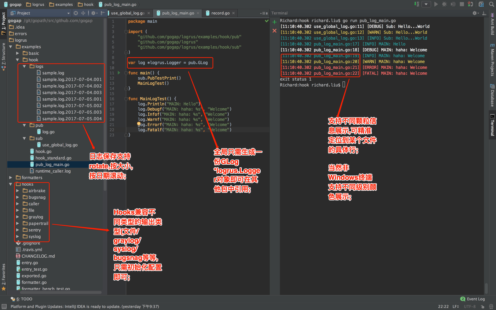

## logrus
----


### example

```
package main

import (
	log "github.com/gogap/logrus"
	"github.com/gogap/logrus/hooks/file"
	"github.com/gogap/logrus/hooks/graylog"
)

func main() {
	log.SetFormatter(&log.JSONFormatter{})

	//输出到graylog
	glog, err := graylog.NewHook("boot2docker:9001", "yijifu", nil)
	if err != nil {
		log.Error(err)
		return
	}
	log.AddHook(glog)

	//输出到文件
	log.AddHook(file.NewHook("logs/ss.log"))
	
	//yijifu组件中的member模块的日志
	log.WithField("biz", "member").Errorf("member not login,member is %s", "1001")
}

```

## log in file example

```
2015/06/29 15:24:52 [ERROR] member not login,member is 1001
github.com/gogap/test_case/logrus.go:23[biz:membe]

```

## Log in file for standard example.

```
package main

import (
    "github.com/gogap/logrus"
    "github.com/gogap/logrus/hooks/file"
    "os"
)

var log *logrus.Logger

func init() {
    log = logrus.NewLogger(
        os.Stderr,
        &logrus.StandardFormatter{
            PrintFormat: "[%D %T %s] [%L] %M",
            ForceColors: true,
            DisableColors: true,
            FullTimestamp: true,
            DisableSorting: false,
        },
        logrus.DebugLevel,
    )

    config_json := `{
    	"filename": "logs/sample.log",
    	"maxlines": 50,
    	"maxsize" : 10000000,
    	"daily"   : true,
    	"maxdays" : 15,
    	"rotate"  : true,
    	"level"   : 5
     }`
    log.Hooks.Add(file.NewHook(config_json, "[%s] [%L] %M"))
}

func main() {

    test()

    log.Debug("Hello %s", "World, I'm richard.liu@nio.com")

    log.Errorf("test-Error:%s", "How do i do?")

    log.WithFields(logrus.Fields{
        "animal": "walrus",
        "size":   10,
    }).Info("A group of walrus emerges from the ocean")

    log.WithFields(logrus.Fields{
        "omg":    true,
        "number": 122,
    }).Warn("The group's number increased tremendously!")

    log.WithFields(logrus.Fields{
        "omg":    true,
        "number": 100,
    }).Fatal("The ice breaks!")
}

func test() {
    log.Errorf("test: error: %s.\n", "you are 1900.")
}
```

## log on gray log example


## log on common file example.


## Logrus的整体调用关系
```                  
type LoggerInterface interface {
    Init(config string) error
    WriteMsg(msg string, level int) error
    Destroy()
    Flush()
}

type Hook interface {
	Levels() []Level
	Fire(*Entry) error
}

// Internal type for storing the hooks on a logger instance.
type LevelHooks map[Level][]Hook
    Add(hook Hook)
    Fire(level Level, entry *Entry) error 

type Formatter interface {
	Format(*Entry) ([]byte, error)
}

type Entry struct {
	Logger *Logger
	Data Fields
	Time time.Time
	Level Level
	Message string
}

type Logger struct {
	Out io.Writer
	Hooks LevelHooks
	Formatter Formatter
	Level Level
	mu sync.Mutex
}
------------------------------------------------------------------------
                                     airbrake
                                      bugsnag
                                       file  <=> type FileHook struct {
                                        ∆             PrintFormat string	                   
                                        |         	  W LoggerInterface   <==> FileLogWriter => 这个就是写入日志文件的包装类;
                                        |         }
                                        |
                                type Hook interface {
                                	Levels() []Level
                                	Fire(*Entry) error
                                }
                                type LevelHooks map[Level][]Hooks
                      Hooks LevelHooks 
Entry <-> Logger <->  ...  < 最终通过Entry的log()函数,将Logger.Debug() Info() ... 写入各种Hook和终端>
                      Formatter Formatter 
                                type Formatter interface {
                                	Format(*Entry) ([]byte, error)
                                }
                                        |
                                        |
                                        V
                                    json_formatter
                                    text_formatter
                                    log_formatter  <=> 新增的日志类型打印格式;
------------------------------------------------------------------------
```

## 新增的异步刷新模块和同步耗时对比:
```
Richard:~ richard.liu$ 14.234409562s- 去掉日期和时间后 同步日志时间缩短3.4s
Richard:~ richard.liu$ 7.522721016s - 000 - 缓冲区8K时,150万条记录, 异步缓冲耗时时间7.52s
Richard:~ richard.liu$ 7.368699017s - 缓冲由8K增加到80K时间缩短并不明显;
Richard:~ richard.liu$ 6.50236745s  - 001
Richard:~ richard.liu$ 6.354582993s - 002
Richard:~ richard.liu$ 7.39826566s  - 003
Richard:~ richard.liu$ 6.656854032s - 004
Richard:~ richard.liu$ 5.438684966s - 011 - 缓冲区800K时 150万条记录时间 5.43s
Richard:~ richard.liu$ 5.415431373s - 012
Richard:~ richard.liu$ 5.563953262s - 013
Richard:~ richard.liu$ 4.638735158s - 021 - 缓冲区8MB时 150万条记录时间 4.64s 就是说缓冲区越大时 间越短
Richard:~ richard.liu$ 4.617190242s - 022
Richard:~ richard.liu$ 4.62199042s  - 023
Richard:~ richard.liu$ 14.352677898s - 同步一条条记录 150万条日志时间14.35s 耗时3倍长;

异步缓冲区的大小设定;
```